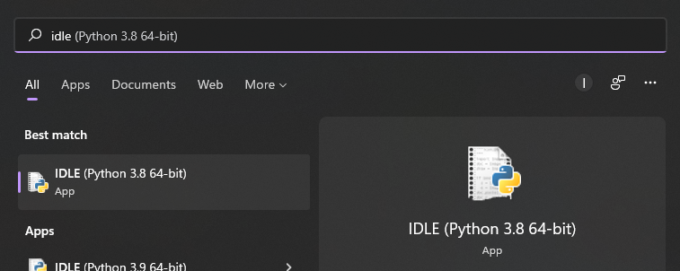
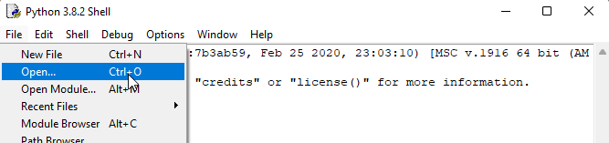
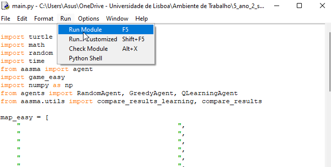
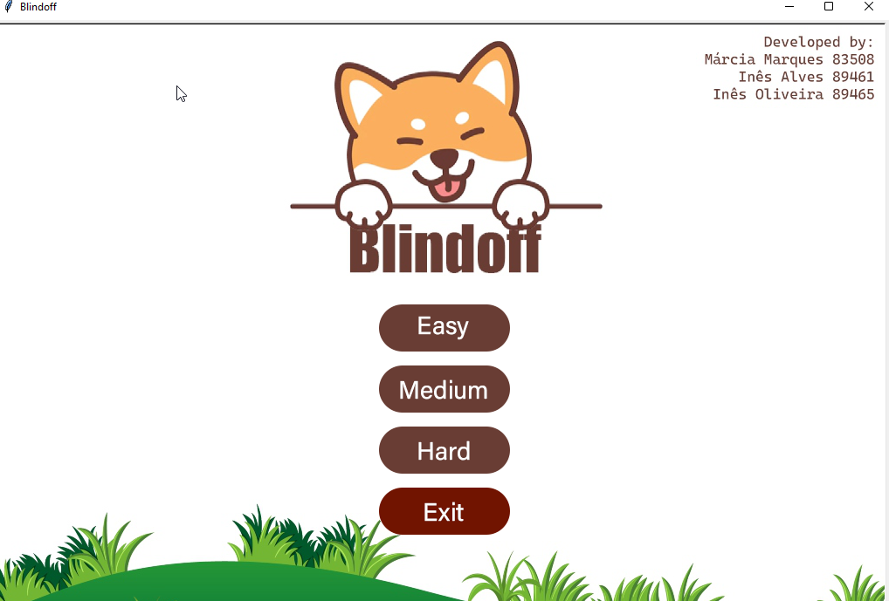
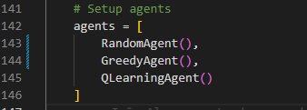
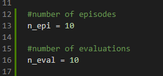

# Robotic Guide Dog for Visual Impairment People
AASMA project - 2021/2022
Group 42 

##  Usage

Open the your IDLE

Open the `main.py` file

Run the file

In the menu, select the level you want to see

This will run all the agents, first the random, then the greedy, and then the q-learning agent. It will run 10 episodes each at the level you selected in the menu and after that will show the graphics with the results. We choose to evaluate 3 different variables: steps, score, and time. So it will test each one individually and show a graphic for each one too.

To run each agent individually, edit `main.py` in the `agents` array:

you can comment the agents you don't want to see and just run again

To change the number of episodes and the number of evaluations (for the q-learning agent), you can edit `main.py` and change the global variable corresponding to those:

